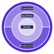

# Meal Planner - Get familiar with technologies

Dette repo er lavet for at lege med Clean Architecture Template backend og Next.JS frontend. Jeg har valgt at lave et projekt med en Meal Planner med en AI integration, som vil gøre det muligt at generere opskrifter med prompts, hvor opskrifterne vil blive genereret. Her vil man så kunne fordele de forskellige retter ud på ugen, hvorefter en samlet indkøbsliste vil blive lavet.

Denne README beskriver den overordnede arkitektur af projektet, hvor netop Clean Architecture Template og Next.JS er kombineret, så jeg kan blive rigtig god til det :). Der ligger samtidig en "ordbog" med begreber til teknologierne sammen med en lille forklaring. NB: Vil blive opdateret løbende.

Jeg har valgt at samle både frontend og backend i et enkelt repo for overskuelighed.

---

## 1. Arkitektur

Projektet er opdelt i to systemer, der udelukkende kommunikerer via REST API (JSON). 

### Frontend (`/frontend`)
* **Ansvar:** Brugergrænseflade, interaktivitet og præsentation.
* **Framework:** Next.js 14.
* **Sprog:** TypeScript / TSX.
* **Styling:** Tailwind CSS sammen med shadcn/ui-komponenter.
* **Data Fetching & State:** TanStack Query til at håndtere API-kald osv.
* **Tabeller:** TanStack Table (bruges til indkøbslisten).

### Backend (`/backend`)
* **Ansvar:** Logik og sikkerhed.
* **Framework:** .NET
* **Sprog:** C#
* **Arkitektur:** Jason Taylors Clean Architecture Template
* **Database:** SQLite med Entity Framework.
* **Kommunikation:** CQRS med MediatR.

---

## 2. Backend: Clean Architecture Template

I backenden er koden opdelt i de fire essentielle lag. Her er den vigtigste pointe, at en afhængighed **kun** må pege indad. Altså må et indre lag aldrig kende til et ydre lag. Opdelingen er som følger:

1. **Domain:** Det inderste lag. Dette indeholder Entities som f.eks. `Recipe.cs` og `Ingredient.cs`, lister og Domain specific exceptions. Domain-laget er 100% uafhængigt af resten af systemet, og det kender kun til sig selv.
2. **Application:** Dette lag ligger rundt om Domain-laget. Det er her, hvor Commands og Queries er. Det her lag styrer, hvad der skal ske i systemet (f.eks. at oprette en ny opskrift osv.). Dog bestemmer dette lag ikke, hvordan det gemmes i databasen el.lign.
3. **Infrastructure:** Dette lager indeholder meget af det praktiske logik. Det er her, hvor C#-modellerne bliver oversat til tabeller i databasen (dette sker i `ApplicationDbContext`). Det er også her, hvor kaldene til AI-integrationen er. 
4. **Presentation:** Det yderste lag. Dette lag modtager HTTP-requests fra frontenden (Next.js) og sender data videre til Applikations-laget med MediatR.

https://cleanarchitecture.jasontaylor.dev/
---

## Ordbog

Her er en begrebsliste med vigtige begreber og koncepter fra de teknologier, som er benyttet.

### Generelle Koncepter
* **CI/CD:** Automatiserede pipelines, der bygger, tester og releaser koden.
* **API:** Frontenden beder API'et om noget data, og API'et henter det i databasen og giver det tilbage som JSON-data i dette tilfælde.
* **JSON:** Et standardiseret tekstformat til at sende data mellem frontend og backend.

### Backend
* **Entity:** En model, der repræsenterer noget fra den virkelige verden (business-rules). Dette kunne være en opskrift i dette tilfælde. Entities har sit eget unikke ID.
* **DbContext (ApplicationDbContext):** Dette er sammenhængen mellem C#-koden og databasen. Den holder styr på, hvilke objekter der er ændret, og den oversætter til SQL.
* **Entity Framework Core:** Det er et ORM-værktøjindbygget, som er indbygget i .NET, der gør det muligt at skrive database-kode i C# i stedet for SQL.
* **CQRS:** En arkitektur, der adskiller kode, der læser data (Queries), fra kode, der ændrer data (Commands).
* **Command:** Det er en handling, som ændrer tilstanden i systemet. Dette kunne være at oprette eller slette en opskrift i dette tilfælde.
* **Query:** Det er en anmodning om data. Det ændrer ikke noget i systemet, men det kunne f.eks. være at hente listen over ugens retter i dette tilfælde.
* **MediatR:** Det er et C# bibliotek, som bruges til at implementere CQRS. Præsentations-aget sender en beksed med MediatR, som finder den rigtige Command/Query i Applikations-laget og giver tilbage.
* **Dependency Injection:** Dette er et princip, hvor et objekt modtager sine depedencies udefra i stedet for selv at oprette dem. 
* **Data Transfer Object:** Det er et objekt, der bruges til at transportere data mellem backend og frntend, så man "skjuler" de pågældende entities fra Domain-laget.

### Frontend
* **TypeScript:** Dette er et sprog, som er bygget oven på JavaScript, hvor det blot er en mere skudsikker version i form af, at der er statiske typer, og ens editor nemmere kan opdage errors.
* **TSX:** En filtype i Next.js, hvor man kan skrive  HTML inde i TypeScript-kode.
* **SSR (Server-Side Rendering):** Next.js kan bygge HTML-siden på serveren, før den sendes til brugeren.
* **TanStack Query:** Det er et bibliotek, som henter data fra et API. Det sørger automatisk for at gemme data, vise loading-spinners og hente ny data, hvis der sker fejl i backenden.
* **Tailwind CSS:** Dette er et "utility-first" CSS-framework, hvor man styler sine elementer ved at skrive små klasser direkte i HTML-elementet i stedet for i en separat CSS-fil.
* **shadcn/ui:** Dette er et bibliotek, som indeholder færdigebyggede UI-komponenter, om man kan hente dirkete ind i sit projekt.